# Introduction

Influenza is a well known and common human respiratory infection. It is responsible for significant morbidity and mortality every year. The World Health Organization (WHO) estimates that annual epidemics result in about 3 to 5 million cases of severe illness and about 250,000 to 500,000 casualties worldwide [1]. Influenza has a seasonal pattern, and in the Northern hemisphere, epidemics occur between November and March. 

Public health specialists seek more effective and equitable response systems, but methodological problems frequently limit the usefulness of novel approaches [@Closas:2012jn].
An extensive body of the literature exists on mathematical and computational models for studying the temporal dynamics of influenza outbreaks. The main purpose of some of these models is to inform public policy regarding the selection and allocation of public health interventions and resources during a pandemic.1 Reliable forecasts of measures such as peak time, peak height, and magnitude during an outbreak would inform public health practitioners and healthcare workers on when to expect a surge in demand for healthcare resources and infrastructure and the overall expected public health impact of an outbreak. Although timely forecasts of these measures would be beneficial, making reliable predictions during an outbreak remains a public health challenge.


<!-- #### Used data sources and methods for predicting influenza -->

In the field of syndromic surveillance, various sources are exploited for influenza activity detection, monitoring and prediction. The assumption is that by systematically collecting and analysing data such as air temperature and humidity [@Tamerius:2013bm, Monamele:2017du], social network posts [@Alessa:2018db], web-querries to national health information systems [@Hulth:2009go], and Google searches  (Google Flu) [@Dugas:2013dc].  Earlier detection will, in turn, allow for interventions that are assumed to lower the morbidity and mortality resulting from the outbreak [@Hulth:2009go]. 

According to [@Nsoesie:2014hu], the autoregressive integrated moving average (ARIMA)  has been a dominant approach for modelling influenza outbreaks dynamics. "ARIMA models capture lagged relationships that usually exist in periodically collected data. In addition, temporal dependence can also be adequately represented in models that are capable of capturing trend and periodic changes." [@Nsoesie:2014hu, p 310]. The biggest assumption of ARIMA models is that the future values can be predicted based on the past observations. This imposes a limitation, as influenza dynamics is not consistent from season to season.
Example studies employing ARIMA approach for modelling influenza activity include: [@JessicaSell:2014gi, Soebiyanto:2010be, Kane:2014dc, Monamele:2017du].

<!-- ### Regression models -->

<!-- ### About this project -->


This report describes a study on calls to a Swedish nation-wide medical information service, with influenza as a case study. The hypothesis of the work is that influenza associated syndromes captured from calls would provide a basis for the estimation of the timing of the peak and the intensity of the yearly influenza outbreaks that would be as good as the existing laboratory surveillance.


<!-- # Background -->

<!-- ## Stationarity -->

<!-- ### Unit Root Tests -->
<!-- The stationarity /non-stationarity of the data can be known by applying Unit Root Tests – augmented Dickey-Fuller test (ADF), Kwiatkowski-Phillips-Schmidt-Shin (KPSS) test. -->

<!-- #### Augmented Dickey-Fuller (ADF) tests  -->

<!-- An augmented Dickey-Fuller test (ADF) tests the null hypothesis that a unit root is present in a time series sample, i.e., the data are non-stationary. ADF procedure tests whether the change in Y can be explained by lagged value and a linear trend. If a contribution of the lagged value to the change in Y is non-significant and there is a presence of a trend component, the series is non-stationary and null hypothesis will not be rejected. -->

<!-- So large p-values are indicative of non-stationarity, and small p-values suggest stationarity. Using the usual 5% threshold, differencing is required if the p-value is greater than 0.05. -->


<!-- ## ARIMA -->

<!-- ### Step 5: Autocorrelations and Choosing Model Order -->
<!-- ACF plots display a correlation between a series and its lags. In addition to suggesting the order of differencing, ACF plots can help in determining the order of the MA (q) model.  -->

<!-- Partial autocorrelation plots (PACF), as the name suggests, display a correlation between a variable and its lags that is not explained by previous lags. PACF plots are useful when determining the order of the AR(p) model. -->

# Datasets

There are three datasets considered:

1. The number of laboratory-diagnosed cases of type A and type B influenza ("LDI"). Time period: 2008-2017, periodicity: daily. 
2. The total number of laboratory tests, where influenza is suspected ("denominator"). Time period: 2010-2017, periodicity: weekly.
3. Records for calls to 1177 Vårdguiden ("1177"). Time period: 2010-2017. periodicity: daily.


The “1177” dataset contains calls as observations and the following dimensions: "date","area","syndrome","action","age group","gender". For purposes of this project, only the "date" and the "syndrome" dimensions are further used. The "date" contains a calendar date for when the calls are placed. The "syndrome" contains one out of 77 “core” syndromes associated with the call (one for each call). The syndromes are assigned by the nurses taking the calls. It is worth noting that while a person might describe several syndromes - only one is assigned to the call under this dimension. Examples of syndromes include: "Fever - child", "Allergic symptoms", "Cough - adult", etc.
<!-- Presumably, the recorded syndrome should be of the higher severity among  -->


## Exploring the datasets

### "1177" dataset manipulation
The daily number of calls associated with each syndrome was counted. Furthermore, a total number of calls for each date was calculated in order to define a relative frequency of each syndrome daily. Therefore, the data was normalised as the percentage of calls being associated with each syndrome. 
The normalisation is mostly done in order to detrend the time series, as there is a trend of the overall growing use of the 1177 system over time.

Notably, a daily number of calls includes calls with no associated syndromes (NA for "syndrome") and with syndromes, which are later excluded from the analysis. Therefore, the relative frequencies of syndromes don't necessarily sum up to 1 in the reduced dataset used for final modelling.

The "syndrome" values were translated from Swedish to English using the Google translate service.

<!-- Also, I calculated a total number of calls for each date in the 1177 dataset in order to later define a relative frequency of each syndrome daily. Notably, I calculated a total number of calls from the raw data, which includes syndromes, which are later dropped from the analysis. Therefore, the relative frequencies of syndromes don't necessarily sum up to 1 in a reduced dataset without dropped variables. We used the overall number of calls in order to avoid the impact of the overall growing use of the 1177 system over time (i.e., detrend time-series). -->

### Irrelevant syndromes

Upon further exploration, some of the syndromes were deemed to be clearly irrelevant for the influenza activity modelling, and, therefore were excluded from further consideration. These syndromes include: "Allergic symptoms","Administrative action","NA_syndrome","Munha_lebesväru","Burn","Drugs question","Itching","General medical information","Depression", "Swallowing disorders","Anxiety".


### Missingness
The 1177 dataset contains almost 41% of missing values for syndromes. 


The figure X plots all the syndromes plotted as time-series, where the red lines indicate the missing values. As can be seen from the figure - many missing values are not equally distributed in different time-series.

Some syndromes time-series have apparent "gaps" in time (see the figure X below)

### Observations upon data structure
Many syndrome time-series have a lot of missing values. A most likely explanation for this is the fact that the 1177 dataset is a merge of 1177.se and Vårdguiden data, which happened sometime in 2013/2014. There are several issues caused by that.

1. Several syndromes are seemingly the same or directly related yet split into 2 or more time series, (e.g., "Diarrhea - children", "Diarrhea - children over 6 months", "Diarrhea - infants (0-12 months)","Diarrhea - infants 0 - 6 months").
2. Presumably, datapoints for some syndromes were summed up, which might result in messing the time-series. E.g., "Dizziness" and "Skin lesion" have evident uplifts in the number of calls around Jan 2014. Albeit this issue is easily remedied by normalising the data by the total number of calls.

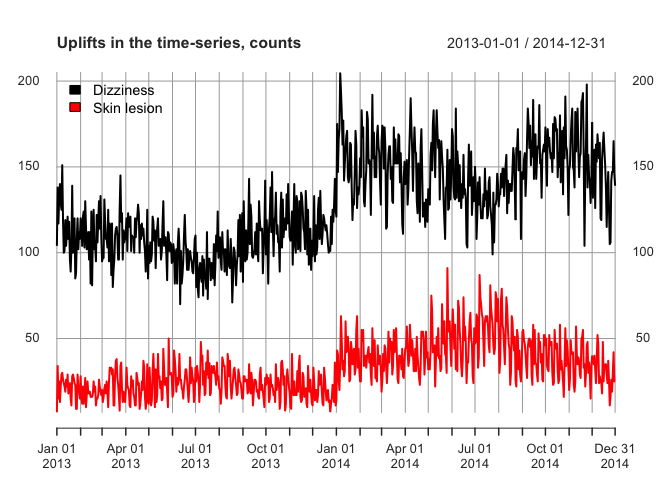<!-- -->

3. Alternatively, some syndromes were broken down into more subsyndromes, e.g. "Diarrhea - children" and "Diarrhea - children over 6 months".

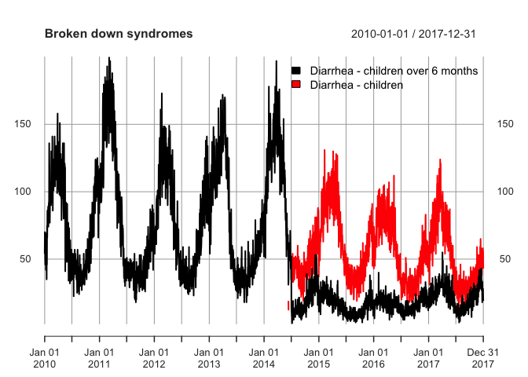<!-- -->

4. Many syndromes related time-series contain long gaps in data, i.e., missing values (see, for example, four syndromes plotted on one chart). 

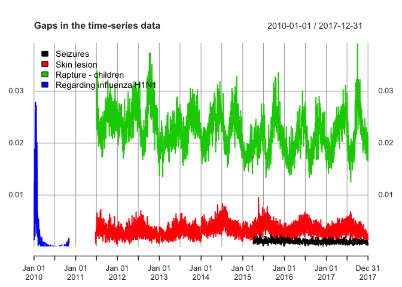

These interruptions in the dataset explain high missingness in the syndromes variables. Notably, the dataset has mostly uninterrupted time-series for the syndromes with high missingness from around the year 2014 and onwards.
Assuming that more data is beneficial for prediction task - we aim to preserve as much data as possible.
Therefore, there is a choice between either taking more syndromes (variables) but limit the timeframe to years 2014-2017, or drop the variables with high missingness but retain the 2010- 2017 time frame with a lesser number of variables.

We decided to exclude the variables with high missingness and consider only a reduced number of variables for further analysis. First, it seems that, to my limited knowledge on influenza, the potentially most relevant syndromes, such as fever, are intact by the aforementioned issues. Furthermore, as we assume more data on the historical behaviour of a highly seasonal phenomenon of influenza is more important than a large number of external variables. Besides, it is usually more valuable to have a model with a low number of variables than with high, i.e., the simpler the model - the better.

Therefore, we selected variables with missingness of less than 1%.

The remaining missing values were interpolated with maximum gap of two consequative missing data points.

Finally, the data was aggregated weekly.


## "Denominator" data

The denominator dataset merely contains a total weekly number of laboratory tests where influenza was suspected. Note an evident ascending trend in the number of tests  (figure X). This warrants the need to normalise the number of positive tests with the total number of tests in order to scale and, thus, de-trend the LDI data. 

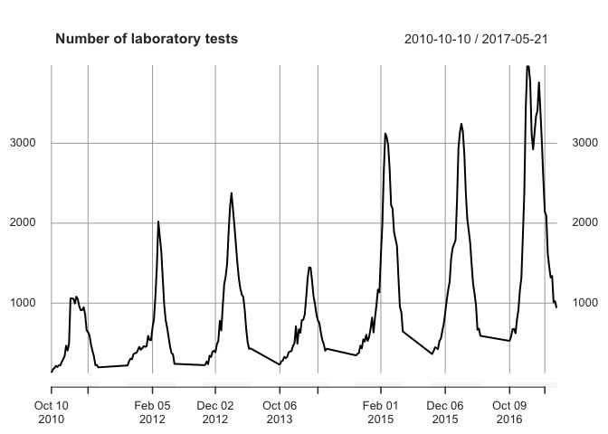<!-- -->


Since the total number of tests might be different over time, it is important to scale the number of positive influenza cases to the total number of tests. This is a form of detrending the time-series. 

The data on a "total number of tests weekly" is available for the 2009-2018 period. However, since there was an influenza pandemic in 2009, it was decided to exclude from the further analysis - the 2009 year is considered as an outlier in the context of seasonal influenza.

Furthermore, the 2017/2018 season is incomplete, therefore the 2017/2018 season is skipped as well.


## Preparing and aggregating the LDI dataset

The LDI dataset contains a daily number of laboratory-diagnosed influenza cases for influenza type A and type B in Sweden. The daily data is available for the 2008-2017 time period.

<!-- ```{r plot influenza types A and B, echo=FALSE, warning=FALSE} -->

<!-- LDI -->
<!-- type_A_B_plot <- join %>% select(test_date, count_A=count_positive.x, count_B=count_positive.y) -->
<!-- plot(xts(type_A_B_plot[,2:3], order.by =type_A_B_plot$test_date), main="LDI dataset: influenza type A and type B", legend.loc="topright") -->

<!-- ``` -->

It was decided not to differentiate between different types of influenza, and therefore, to sum up the counts for different influenza types and consider only the total number of influenza cases.

It's worth noting that the data for laboratory-diagnosed influenza is recorded only for so-called "influenza seasons". This means that the data during off-seasons are missing. The season is conventionally defined as a period of week 40 (current year) to week 20 (following year).

Since the LDI dataset needs to be normalised with the total number of tests, the LDI data needs to match the timeframe of the "denominator" and be aggregated weekly instead of daily.


The final LDI dataset depicting the weekly percentage of positive influenza tests is plotted at figure X.

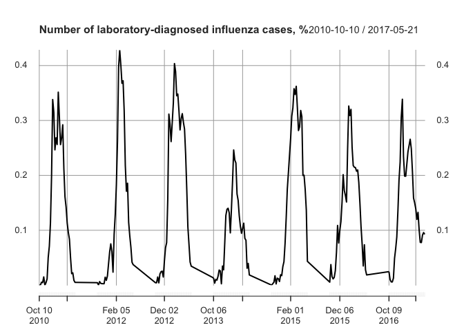<!-- -->


<!-- # Problem definition -->

<!-- The aim of this project is to model seasonal influenza activity and enable forecasting of future behaviour based upon syndromic surveillance and/or the influenza historical behaviour. -->

## Evaluation setting

The datasets were subset into "training" period covering influenza seasons from 2010-2016 (six influenza seasons) and "testing" period covering the 2016/2017 season (one influenza season). 


<!-- # Modelling with ARIMA aproach -->
<!-- great source: https://www.otexts.org/fpp/8 -->
<!-- I need SARIMA http://people.duke.edu/~rnau/seasarim.htm -->

<!-- ## Stationarity -->

<!-- Fitting an ARIMA model requires the series to be stationary. A stationary time series has "stable" mean, variance, and autocovariance , i.e., these properties do not depend on the time at which the series is observed.  -->


<!-- "This assumption makes intuitive sense: Since ARIMA uses previous lags of series to model its behaviour, modelling stable series with consistent properties involves less uncertainty.  -->

<!-- Time series with trends and/or with seasonality ar not stationary. -->

<!-- We used augmented Dickey-Fuller (ADF) tests and Kwiatkowski-Phillips-Schmidt-Shin (KPSS) unit root tests to determine if each of the data source time series variables were stationary or would require differencing.  -->
<!-- ```{r ADF test, echo=FALSE, warning=FALSE} -->
<!-- tseries::adf.test(as.zoo(trainLDI)) -->


<!-- ```{r KPSS test, echo=FALSE, warning=FALSE} -->
<!-- tseries::kpss.test(as.zoo(trainLDI)) -->


<!-- ### Testing seasonality -->
<!-- Each of the sources was also tested using seasonal root tests to determine the appropriate number of seasonal differences required. -->


<!-- #### Autocorrelation function (ACF) -->
<!-- ACF plots display the correlation between a series and its lags. In addition to suggesting the order of differencing, ACF plots can help in determining the order of the M A (q) model.  -->


<!-- ```{r Autocorrelation ACF PLOT, echo=FALSE} -->

<!-- # par(mfrow=c(2,1)) -->
<!-- # Acf(LDI, main='') -->
<!-- Acf(trainLDI, main='', lag.max=60) -->


<!-- #### Partial autocorrelation (PACF) -->

<!-- ```{r  Partial autocorrelation plots (PACF) , echo=FALSE} -->
<!-- # Pacf(LDI, main='') -->
<!-- Pacf(trainLDI, main='', lag.max=60) -->


<!-- Given that the ACF tails off and PACF cuts off at lag 2, the S(AR) order should be increased.  -->

# Fitting regression models
## Fitting an ARIMA model
To fit an ARIMA model we executed the auto.arima function in the "forecast" package, which finds best ARIMA model according to either AIC, AICc or BIC value. The function conducts a search over possible model within the order constraints provided. 


The prediction for selected ARIMA(4,0,1) model is depicted below (figure X).

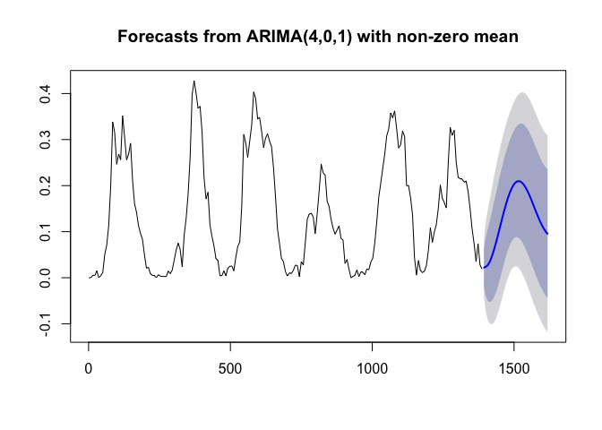


## Modelling with partial least squares regression

We fit a partial least squares regression model to the train datasets (syndromes are independent variables, and share of positive tests is a predicted variable). We use "plsr" function from the "pls" package. The default 10-fold cross-validation was used.

```r
library("pls")

{y <- trainLDI %>% coredata()
X <- trainSyndrome %>% coredata()
# do PLS regression with 2-fold cross validation:
pls_model_10CV <- plsr(y ~ X, 
            validation = "CV",
            # segment.type="consecutive",
            # segments=6,
            #,segments = cvsegments(66, length.seg = 33, type = "cons")
            # method = "kernelpls"
            method = "simpls"
            )}
# summary(pls_model_10CV)
```

The below chart shows the mean squared error of prediction based upon a number of components. Seemingly, a five seems to be the "best" number of components.

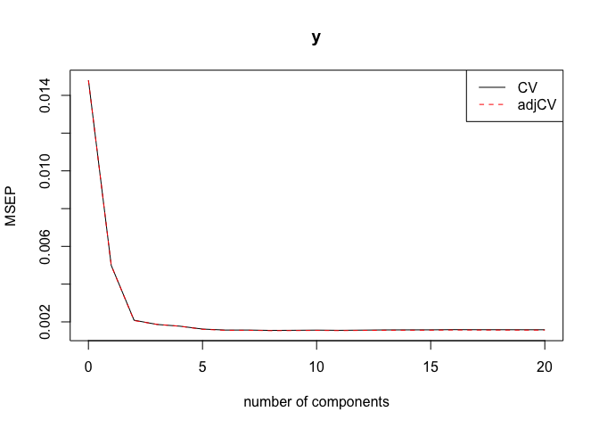<!-- -->

The below chart shows the root mean squared error of prediction based upon a number of components. Similar to MSEP, a five seems to be the "best" number of components.

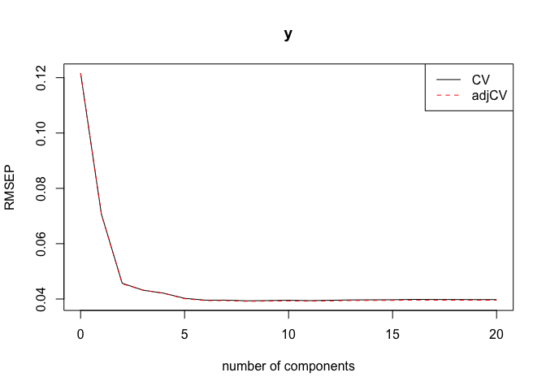<!-- -->


As the MSEP and RMSEP charts shows, the inclusion of additional components tend to decrease errors, however, there is a clear diminishing reduction of errors. Moreover, simpler models, read less number of components, tend to be more flexible and give better forecasts.

There are two consistent strategies for choosing the "optimal" number of components. The first is based on the so-called one-sigma heuristic [8] and consists of choosing the model with fewest components that is still less than one standard error away from the overall best model. The second strategy employs a permutation approach and basically tests whether adding a new component is beneficial at all [21](Van der Voet, 1994). As long as no significant deterioration in performance is found (in my case on the alpha = 0.01 level), the algorithm continues to remove components; the smallest model not significantly worse than the reference model is returned as the selected one.

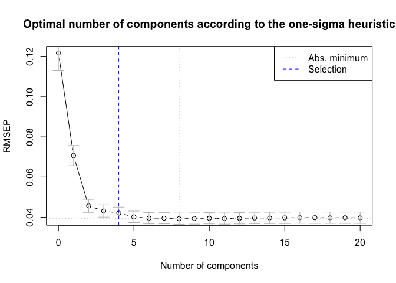<!-- -->

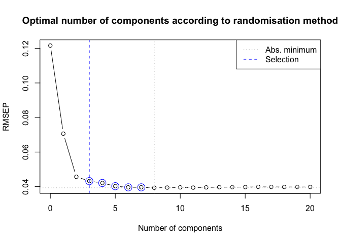<!-- -->

Both algorithms agree on the five as the number of components. Therefore we proceed with this number for further testing of this model.


### Predicting influenza activity with PLSR

First, lets see how the model fits the training dataset (figure X).

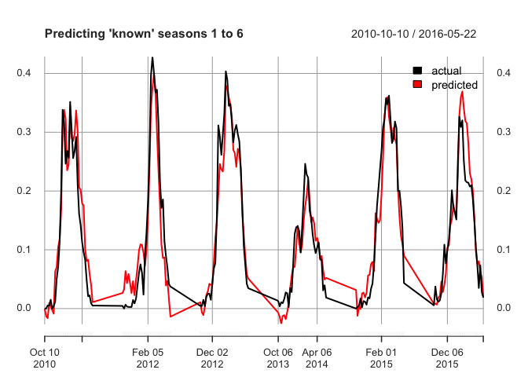<!-- -->

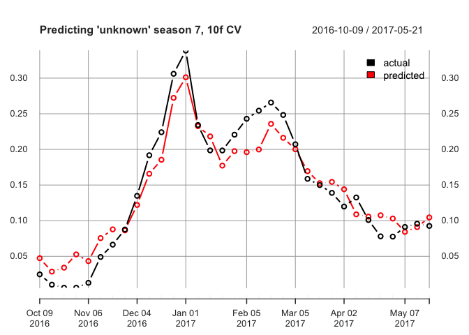<!-- -->

<!-- ```{r predicting scores} -->
<!-- # It is often interesting to predict scores from new observations, instead of response values. This can be done by specifying the argument type = "scores" in predict. One will then get a matrix with the scores corresponding to the components specified in comps (ncomp is accepted as a synonym for comps when predicting scores). -->
<!-- pred_results_TEST_score <- predict(pls_model, -->
<!--                               ncomp = 4, -->
<!--                               newdata = trainSyndrome, -->
<!--                               type = "scores") -->
<!-- # matplot(cbind(coredata(testLDI),pred_results_TEST), type= c("b"), pch=1) -->


<!-- plot(merge.xts(trainLDI,pred_results_TEST_score), type="b") -->


<!-- # It is often interesting to predict scores from new observations, instead of response values. This can be done by specifying the argument type = "scores" in predict. One will then get a matrix with the scores corresponding to the components specified in comps (ncomp is accepted as a synonym for comps when predicting scores). -->


<!-- RMSEP(pls_model, newdata = testLDI) %>% plot -->
<!-- ``` -->


### "Leave one season out"
In the above model, 10-fold cross-validation randomly subset the dataset into 10 datasets in order to train/validate the model. This effectively ignores the time-dependance and seasonality of the influenza activity. Often, influenza-related models build and test upon whole influenza seasons. There are seven full influenza seasons in the dataset.
Therefore, the cross-validation parameters were set so that the models are built upon six seasons and tested upon the one being left. This approach could be called "leave one season out".


#### (R)MSEP and number of components 

The below chart shows the mean squared error of prediction based upon a number of components. Three is the "best" number of components according to the one-sigma and randomisation methods.

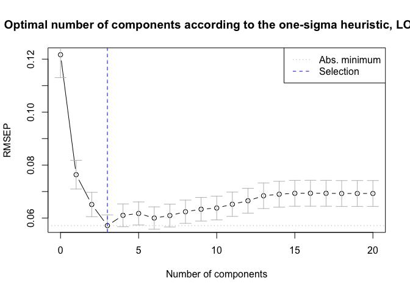<!-- -->

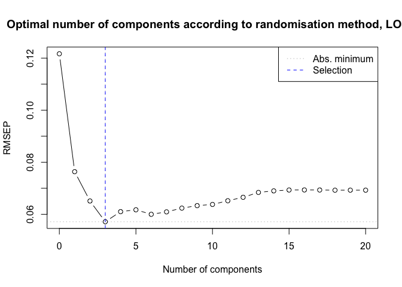<!-- -->


Further, predictions were made based upon the training dataset itself in order to estimate how well the model fits the data.


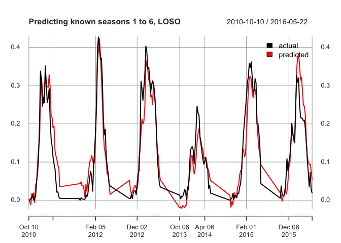<!-- -->

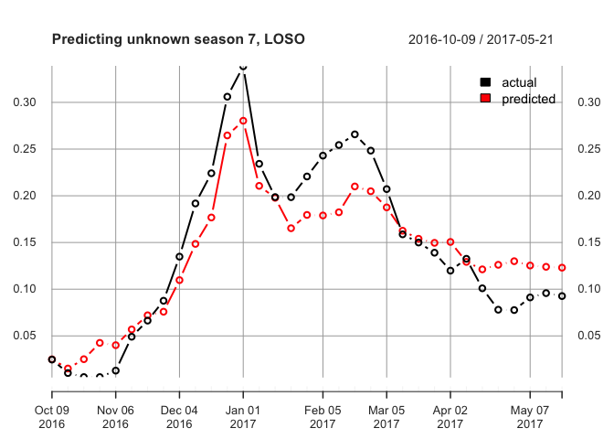<!-- -->
Finally, the prediction for the 7th season was made (figure X).

# Comparing accuracy metrics of the two models
The performance of both models is to be estimated using a set of accuracy metrics.

The following metrics were calculated for predictions in order to estimate the models' accuracy:

- ME: Mean Error

- RMSE: Root Mean Squared Error

- MAE: Mean Absolute Error

- MPE: Mean Percentage Error

- MAPE: Mean Absolute Percentage Error


## Estimating the fit to the training set
First, we see how good each model fits the training data.

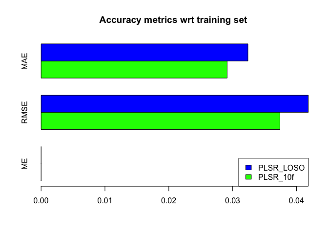<!-- -->

As can be seen from the chart, the 10-fold CV fits the data slightly better.

## Estimating accuracy for the test set
The next chart shows the errors in predicting the test season.

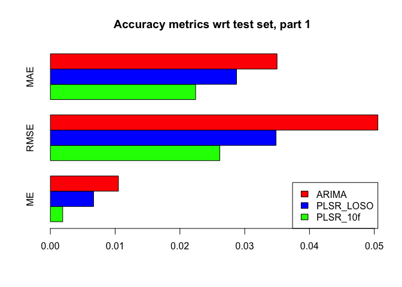<!-- -->

As can be seen, the PLSR_10f performs better if judging from the ME, RMSE, and MAE. 

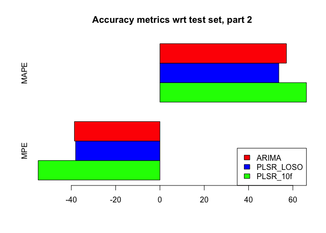<!-- -->

However, according to percentage based errors (MPE,MAPE) - PLSR_LOSO performs better. Notably, negative MAPE indicates that both models tend to underestimate the LDI percentage value.


# Discussion
This study aims at estimating the percentage of positive laboratory-confirmed cases of influenza through the calls to Swedish medical information system (1177 Vårdguiden). We calculated the occurrence of various syndromes from the calls for seven influenza seasons. These figures were subsequently used to generate a model estimating the proportion of laboratory verified influenza cases. We applied an approach designed for highly correlated data, partial least squares regression. Furthermore, we fitted an ARIMA model to the proportion of positive laboratory-confirmed cases to use as a baseline for performance comparison. The model utilising the data on calls outperforms the conventional ARIMA model rendering calls to medical information systems valuable as an accurate and cheap source for syndromic surveillance.


# Bibliography
